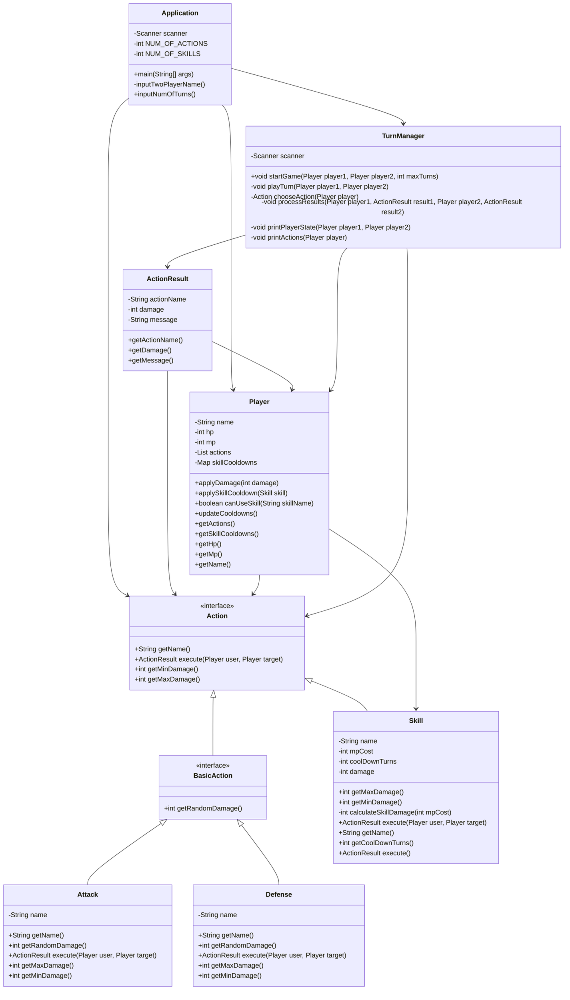

# 턴제 게임
## 구현 기능
### 상황 설정
두 명의 플레이어가 하나의 컴퓨터 앞에 나란히 앉는다.  
application 실행 시 터미널 창에 플레이어 이름, 진행하고자 하는 턴 수를 입력한다.

게임을 시작한다.

### 게임 중..

플레이어 1의 행동 선택 후, 플레이어 2의 행동을 선택한다. 두 플레이어의 행동이 모두 끝난 후 결과를 출력하며,
#### 이것을 하나의 턴이 '종료' 되었다고 정의한다.

주어진 턴까지 도달하거나, 주어진 턴까지 진행되는 도중 hp가 0인 사람이 발생한다면 게임은 종료된다.

할 수 있는 행위는 공격, 방어, 스킬이 있다. 공격과 방어는 기본 행위로 취급한다.   
스킬은 특수한 행위로 취급한다. 마나를 소모하며, 한 번의 스킬 사용 후 일정 쿨타임 턴이 소요된다.

### 게임 종료
게임 종료 메세지와 함께 터미널 창을 종료한다.

## Object Diagram(mermaid)

## 클래스 소개

### Application
게임을 진행하기에 앞서 플레이어명과 진행 턴 수를 입력받는다.

플레이어의 사전 입력을 바탕으로 플레이어 정보를 생성하며,  
main 함수 내에 하드코딩을 통해 생성한 행위 목록을 플레이어 별로 세팅해준다.  
현재 두 플레이어 모두 할 수 있는 행위가 같지만,  
코드 수정을 통해 서로 다른 행동 선택지를 부여할 수 있도록 구현하였다.

게임 진행은 `TurnManager`에게 책임을 맡긴다.

정리하자면,  
게임 사전 세팅 담당 클래스이다.
### TurnManager
게임 진행을 관리하는 매니저 클래스이다.

각 플레이어의 현재 상태, 플레이어의 선택지 등을 터미널에 출력한다.  
정해진 양식에 따라 플레이어가 행동을 선택하면 행동 특성(공격, 방어, 스킬)에 따른 결과를  
하나의 턴 종료 후 터미널에 출력한다.

### ActionResult
공격, 방어, 스킬 중에 방어 행위 케이스 분류가 필요했다.
- 두 플레이어가 방어하는 경우
- 둘 다 공격하는 경우
- 한 명만 방어하는 경우

위 경우를 고려하기 위해서는 선공 플레이어의 행위 선택을 후공 플레이어의 선택까지 따로 저장한 후,  
한 턴이 끝난 후에 두 명의 행위의 복합적인 결과를 반영해야만 했다.

이를 위해, 

하나의 플레이어의 행위 선택 결과(데미지 결정, 행위 유형)를 저장하기 위한 클래스이다.
### Player
플레이어 클래스이다.

### Action
행위 인터페이스이다.

기본 행위(공격, 방어)와 스킬을 자식 클래스로 가진다.

### BasicAction
행위 인터페이스를 상속하는 기본 행위 인터페이스이다.  
공격, 방어 클래스를 자식 클래스로 가진다.

### Attack
공격 클래스이다.
기본 행위 인터페이스를 상속한다.
### Defend
방어 클래스이다.
기본 행위 인터페이스를 상속한다.

### Skill
스킬 클래스이다.
'소모 마나'와 '쿨타임 턴수'라는 특수한 필드를 가진다.   
행위 인터페이스를 상속한다.

## [소스 코드 실행 결과](./execution.md)