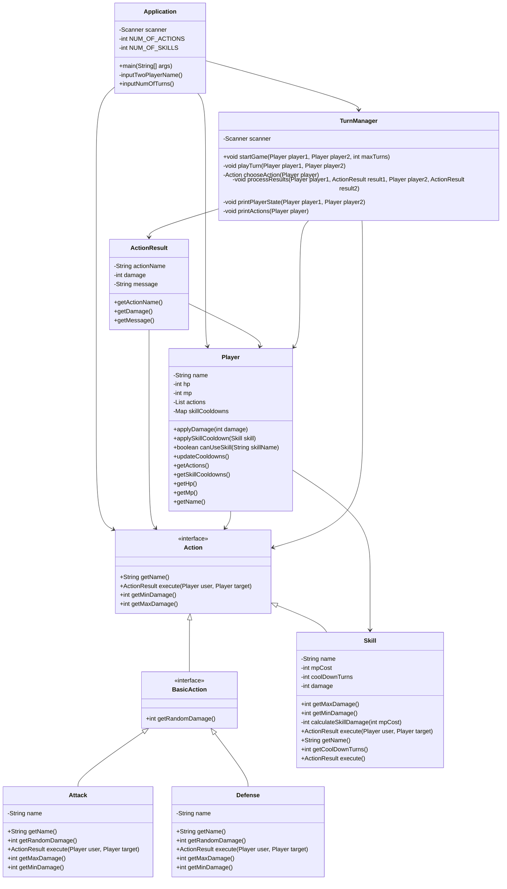

# 턴제 게임 TODO
# 1주차
## _구현 기능_
### 상황 설정
두 명의 플레이어가 하나의 컴퓨터 앞에 나란히 앉는다.  
application 실행 시 터미널 창에 플레이어 이름, 진행하고자 하는 턴 수를 입력한다.

게임을 시작한다.

### 게임 중..

플레이어 1의 행동 선택 후, 플레이어 2의 행동을 선택한다. 두 플레이어의 행동이 모두 끝난 후 결과를 출력하며,
#### 이것을 하나의 턴이 '종료' 되었다고 정의한다.

주어진 턴까지 도달하거나, 주어진 턴까지 진행되는 도중 hp가 0인 사람이 발생한다면 게임은 종료된다.

할 수 있는 행위는 공격, 방어, 스킬이 있다. 공격과 방어는 기본 행위로 취급한다.   
스킬은 특수한 행위로 취급한다. 마나를 소모하며, 한 번의 스킬 사용 후 일정 쿨타임 턴이 소요된다.

### 게임 종료
게임 종료 메세지와 함께 터미널 창을 종료한다.

## Object Diagram(mermaid)

```mermaid
classDiagram

    class Application {
        -Scanner scanner
        -int NUM_OF_ACTIONS
        -int NUM_OF_SKILLS
        +main(String[] args)
        -inputTwoPlayerName()
        +inputNumOfTurns()
    }

    class Action {
        <<interface>>
        +String getName()
        +ActionResult execute(Player user, Player target)
        +int getMinDamage()
        +int getMaxDamage()
    }

    class BasicAction {
        <<interface>>
        +int getRandomDamage()
    }

    class Attack {
        -String name

        +String getName()
        +int getRandomDamage()
        +ActionResult execute(Player user, Player target)
        +int getMaxDamage()
        +int getMinDamage()
    }

    class Defense {
        -String name

        +String getName()
        +int getRandomDamage()
        +ActionResult execute(Player user, Player target)
        +int getMaxDamage()
        +int getMinDamage()
    }

    class Skill {
        -String name
        -int mpCost
        -int coolDownTurns
        -int damage

        +int getMaxDamage()
        +int getMinDamage()
        -int calculateSkillDamage(int mpCost)
        +ActionResult execute(Player user, Player target)
        +String getName()
        +int getCoolDownTurns()
        +ActionResult execute()
    }

    class Player {
        -String name
        -int hp
        -int mp
        -List<Action> actions
        -Map<String, Integer> skillCooldowns

        +applyDamage(int damage)
        +applySkillCooldown(Skill skill)
        +boolean canUseSkill(String skillName)
        +updateCooldowns()
        +getActions()
        +getSkillCooldowns()
        +getHp()
        +getMp()
        +getName()
    }

    class ActionResult {
        -String actionName
        -int damage
        -String message

        +getActionName()
        +getDamage()
        +getMessage()

    }

    class TurnManager {
        -Scanner scanner
        +void startGame(Player player1, Player player2, int maxTurns)
        -void playTurn(Player player1, Player player2)
        -Action chooseAction(Player player)
        -void processResults(Player player1, ActionResult result1, Player player2, ActionResult result2)
        -void printPlayerState(Player player1, Player player2)
        -void printActions(Player player)
    }

    Application --> TurnManager
    Application --> Player
    Application --> Action

    Action <|-- BasicAction
    Action <|-- Skill
    BasicAction <|-- Attack
    BasicAction <|-- Defense
    ActionResult --> Player
    ActionResult --> Action
    Player --> Action
    Player --> Skill
    TurnManager --> Player
    TurnManager --> Action
    TurnManager --> ActionResult
    
```

## 클래스 소개

### Application
게임을 진행하기에 앞서 플레이어명과 진행 턴 수를 입력받는다.

플레이어의 사전 입력을 바탕으로 플레이어 정보를 생성하며,  
main 함수 내에 하드코딩을 통해 생성한 행위 목록을 플레이어 별로 세팅해준다.  
현재 두 플레이어 모두 할 수 있는 행위가 같지만,  
코드 수정을 통해 서로 다른 행동 선택지를 부여할 수 있도록 구현하였다.

게임 진행은 `TurnManager`에게 책임을 맡긴다.

정리하자면,  
게임 사전 세팅 담당 클래스이다.
### TurnManager
게임 진행을 관리하는 매니저 클래스이다.

각 플레이어의 현재 상태, 플레이어의 선택지 등을 터미널에 출력한다.  
정해진 양식에 따라 플레이어가 행동을 선택하면 행동 특성(공격, 방어, 스킬)에 따른 결과를  
하나의 턴 종료 후 터미널에 출력한다.


### ActionResult
공격, 방어, 스킬 중에 방어 행위 케이스 분류가 필요했다.
- 두 플레이어가 방어하는 경우
- 둘 다 공격하는 경우
- 한 명만 방어하는 경우

위 경우를 고려하기 위해서는 선공 플레이어의 행위 선택을 후공 플레이어의 선택까지 따로 저장한 후,  
한 턴이 끝난 후에 두 명의 행위의 복합적인 결과를 반영해야만 했다.

이를 위해, 

하나의 플레이어의 행위 선택 결과(데미지 결정, 행위 유형)를 저장하기 위한 클래스이다.
### Player
플레이어 클래스이다.

### Action
행위 인터페이스이다.

기본 행위(공격, 방어)와 스킬을 자식 클래스로 가진다.

### BasicAction
행위 인터페이스를 상속하는 기본 행위 인터페이스이다.  
공격, 방어 클래스를 자식 클래스로 가진다.

### Attack
공격 클래스이다.
기본 행위 인터페이스를 상속한다.
### Defend
방어 클래스이다.
기본 행위 인터페이스를 상속한다.

### Skill
스킬 클래스이다.
'소모 마나'와 '쿨타임 턴수'라는 특수한 필드를 가진다.   
행위 인터페이스를 상속한다.

## [소스 코드 실행 결과](./execution.md)

---
# 2주차
## _구현 기능_
### spring 의존성 추가

`spring`, `spring-boot`, `lombok`, `spring web`,
그리고 `jpa`
(jpa는 이번 미션에서 사용하지 않지만 이후 과제를 위한 세팅)  
관련 의존성을 `build.gradle`파일에 추가하였음.

### 상황 설정

포스트맨으로 게임 진행.

### 게임 시작
시작과 동시에 두 플레이어, 스킬을 포함한 행동 리스트가 세팅이 된다.  

1주차에는 각 플레이어가 고유의 행동을 가질 수 있도록 플레이어 별로 행동을 부여하는 식으로 설계했지만,  
이번에는 ActionRepository에 메모리 저장 형식으로 행동 리스트를 공유하도록 하였다.

### 게임 진행
게임 진행은 포스트맨에서 request를 보냄으로써 진행된다.
action을 request로 보냄으로써 한 플레이어의 한 턴이 시작되는데,
진행 조건에 부합한다면 입력받은 플레이어 행동을 개시한다.

### 게임 끝
게임 진행 시에 보내는 요청과 동일하다.
다만 action을 request로 보냈을 때
만약 끝난 게임이라면 게임 결과를 response로 보낸다.

#### @참고
커스텀 예외 클래스, 에러 메세지 상수화 등  
예외 처리 구현은 다음 주차에 구현 예정.

### 패키지 소개

1. player 패키지
- 플레이어 정보에 관한 내용을 담았다.
- 엔티티, 레포지토리, 서비스 계층을 구현하였다.
- 게임 시작 전, 두 플레이어의 정보를 레포지토리 계층에 저장한다.
2. manager 패키지
- 게임 진행 정보를 담았다.
- 컨트롤러와 서비스 계층을 구현하였다.
- 레포지토리 대신, 저장해야 할 maxTurn(최대 턴수)를 포함한 게임 진행에 필요한 환경을 서비스 계층에 구현하였다.
3. action 패키지
- 모든 행동에 관한 내용을 담았다.
- 엔티티, 레포지토리, 서비스 계층을 구현하였다.
- 레포지토리 계층에 두 플레이어가 공유할 행동 리스트를 담았다.

---
# 3주차
## 리팩토링 시 유의 사항
### interface
interface : only for 다른 객체로부터 요청받은 책임을 나열

따라서 객체 내부에서의 작업은 interface 내부에 포함할 필요가 없음.

### getter, setter 정리
a의 책임을 b에서 지고 있지 않은지 검토 및 수정
(getter setter 메서드 최소화)

### abstract vs. interface
- 전체적인 객체 설계는 interface
- 구현하면서 중복되는 코드는 abstract

## code review 반영 리팩토링
### ActionResult: getDamage()
1주차 미션에서 플레이어가 공격을 선택한 경우, `ActionResult` 인스턴스의 `damage` 필드에 양수 데미지,
방어를 선택한 경우 음수 데미지를 저장하도록 했었다.  
아래 코드는 2주차 미션 코드 중,
ActionResult 데이터를 활용하여 양측 플레이어에게 데미지를 적용하는 `TurnService.java`의 `processResult` 함수이다.  
*(참고: 1주차 ActionResult 속 damage는 2주차에서 damage 매개변수로 전달하도록 하고, ActionResult 클래스는 삭제하여 리팩토링하였다.)*
```java
    public void processResults(Player player1, int damage1, Player player2, int damage2) {
        // 플레이어 1과 2의 선택을 각각 저장
        boolean player1Attacking = damage1 >= 0;
        boolean player2Attacking = damage2 >= 0;

        int damageToPlayer1; // 플레이어2가 플레이어1에게 주는 데미지
        int damageToPlayer2; // 플레이어1이 플레이어2에게 주는 데미지

        if (player1Attacking) {
            if (player2Attacking) { // 둘 다 공격
                damageToPlayer1 = damage2;
                damageToPlayer2 = damage1;
            }
            else {  // 1 공격, 2 방어
                damageToPlayer1 = 0;
                damageToPlayer2 = Math.max(0, damage1 + damage2); // 방어구 + 데미지
            }
        }
        else {
            if (player2Attacking) { // 1 방어, 2 공격
                damageToPlayer1 = Math.max(0, damage2 + damage1);
                damageToPlayer2 = 0;
            }
            else { // 1 방어, 2 방어
                damageToPlayer1 = 0;
                damageToPlayer2 = 0;
            }
        }
     // 데미지 적용
        player1.applyDamage(damageToPlayer1);
        player2.applyDamage(damageToPlayer2);

        currentTurn++; // 턴 종료
    }
```
방어 행위를 적용하는 공격 데미지 계산 시, 방어 데미지만큼 '-' 연산을 적용하는 것이 자연스러움에도, 앞의 설계에 따라 '+' 연산을 사용하게 되어 코드 가독성이 떨어지는 문제가 있었다.  
이번 미션에서는 방어 데미지(음수 값)에 abs메서드를 활용함으로써, 공격 데미지를 방어 데미지만큼 차감하는 **'-'의 시각화** 를 유도하였다.

```java
// (MatchService.java)- processResults 메서드의 일부
private void processResults(Player player1, int damage1, Player player2, int damage2, Match match) {
        Map<String, Integer> damageMap = match.getDamageMap();

        // 플레이어 1과 2의 선택을 각각 저장
        boolean player1Attacking = damage1 >= 0; // 양수면 공격 데미지, 음수면 방어 데미지
        boolean player2Attacking = damage2 >= 0;
        int damageToPlayer1; // 플레이어2가 플레이어1에게 주는 데미지
        int damageToPlayer2; // 플레이어1이 플레이어2에게 주는 데미지

        if (player1Attacking) {
            if (player2Attacking) { // 플레이어 1: 공격, 플레이어 2: 공격
                damageToPlayer1 = damage2;
                damageToPlayer2 = damage1;
                System.out.println("플레이어 1: 공격, 플레이어 2: 공격");
            }
            else {  // 플레이어 1: 공격, 플레이어 2: 방어
                damageToPlayer1 = 0;
                damageToPlayer2 = Math.max(0, damage1 - abs(damage2)); // 공격 데미지 - 방어 데미지
                System.out.println("플레이어 1: 공격, 플레이어 2: 방어");
            }
        }
        else {
            if (player2Attacking) { // 플레이어 1: 방어, 플레이어 2: 공격
                damageToPlayer1 = Math.max(0, damage2 - abs(damage1)); // 공격 데미지 - 방어 데미지
                damageToPlayer2 = 0;
                System.out.println("플레이어 1: 방어, 플레이어 2: 공격");
            }
            else { // 플레이어 1: 방어, 플레이어 2: 방어
                damageToPlayer1 = 0;
                damageToPlayer2 = 0;
                System.out.println("플레이어 1: 방어, 플레이어 2: 방어");
            }
        }
        // 데미지 적용
        player1.applyDamage(damageToPlayer1);
        player2.applyDamage(damageToPlayer2);
        damageMap.clear(); // 두 플레이어의 행동을 저장했던 data 삭제
    }
```
## _3주차 명세 구현_

### h2-database, JPA 활용
#### application.properties 파일
```properties
spring.application.name=2024-2-mission-course-java

server.port=8080

spring.datasource.url=jdbc:h2:file:~/game_db;DB_CLOSE_ON_EXIT=FALSE;AUTO_RECONNECT=TRUE
spring.datasource.driver-class-name=org.h2.Driver
spring.datasource.username=sa
spring.datasource.password=

spring.h2.console.enabled=true
spring.jpa.show-sql=true
spring.jpa.properties.hibernate.dialect=org.hibernate.dialect.H2Dialect

spring.jpa.hibernate.ddl-auto=create
```

#### build.gradle 파일 - dependencies
```
dependencies {
testImplementation 'org.junit.jupiter:junit-jupiter:5.7.1'
testRuntimeOnly 'org.junit.platform:junit-platform-launcher'
implementation 'org.springframework.boot:spring-boot-starter-web'
implementation 'org.springframework.boot:spring-boot-starter-data-jpa'
testImplementation 'org.springframework.boot:spring-boot-starter-test'
implementation 'org.springframework.boot:spring-boot-starter-validation'
compileOnly 'org.projectlombok:lombok'
developmentOnly 'org.springframework.boot:spring-boot-devtools'
annotationProcessor 'org.projectlombok:lombok'
implementation 'com.h2database:h2'
}

```
### Job 패키지 추가

Job 엔티티, 레포지토리
## _기존 코드 수정 사항_
### ActionRepository 삭제, SkillRepository 추가
- 이번 미션 명세에 따라 데이터 저장을 위한 Map, ArrayList 대신 h2-database, JPA를 활용하였다.  
- 데이터 저장 공간으로 사용되던 ActionRepository를 삭제하였고, `Skill`클래스를 엔티티로 구현함과 동시에, 레포지토리 계층인 `SkillRepository를 추가하였다.

### 예외 처리
2주차 코드에서 예외 처리를 정교화하였다.  
플레이어 생성 시, 존재하진 않는 직업을 입력받았을 때의 예외를 처리하기 위한 커스텀 예외(`JobNotFoundException`)를 활용하였다.


### DTO 클래스 `StatusResponse` 삭제
불필요해진 DTO 클래스 삭제

### 유효성 검사
플레이어 생성 시, 클라이언트에게 json 형태로 전달 받은 RequestBody 내용을 DTO 클래스(`PlayerCreateRequest`)를 거친 후 서비스 계층으로 전달한다.  
이 때 `PlayerCreateRequest`에서 `@NotNull`, `@Length`와 같은 어노테이션을 활용하여 각 매개변수 별 유효성을 검증하게 된다.

## _패키지 설명_
### 1. Action 패키지
공격, 방어, 스킬을 다루는 패키지이다.
#### a. basic 패키지
공격, 방어는 모든 플레이어가 가지는 행동 선택지이다.
#### b. skill 패키지
스킬은 쿨타임과 마나 소모가 동반되는 특수한 행동이다.
엔티티, 레포지토리 계층을 포함한다.

### 2. Exception 패키지
커스텀 예외를 담고 있다.

### 3. Match 패키지
- 턴제 게임과 관련된 정보(현재 턴, 참여 중인 플레이어 정보...etc)를 저장하고, 게임을 진행하는 패키지이다.  
- 엔티티, 레포지토리, 서비스, 컨트롤러 계층을 포함한다.  
- DTO 클래스의 집합인 DTO 패키지를 포함한다.

### 4. Player 패키지
- 플레이어 정보를 관리하는 패키지이다.  
- name hp, mp, job, level 정보를 저장한다.

## _API 가이드_

### 시작
- 스킬, 서로 다른 스킬 집합을 가지는 직업, 플레이어 정보를 db에 사전 세팅한 후 게임을 진행한다.  
- 단, 애플리케이션 실행 후에도 클라이언트가 플레이어를 추가할 수 있도록 한다.

[h2-console에 sql문 입력 for 사전 세팅]
```sql
INSERT INTO job (job_name) VALUES ('기사');
INSERT INTO job (job_name) VALUES ('마법사');
INSERT INTO skill (skill_name, skill_mpcost, skill_cooldown, job_name) VALUES ('두 번 베기', 2, 2, '기사');
INSERT INTO skill (skill_name, skill_mpcost, skill_cooldown, job_name) VALUES ('세 번 베기', 2, 3, '기사');
INSERT INTO skill (skill_name, skill_mpcost, skill_cooldown, job_name) VALUES ('세게 때리기', 3, 5, '기사');
INSERT INTO skill (skill_name, skill_mpcost, skill_cooldown, job_name) VALUES ('회오리', 1, 1, '마법사');
INSERT INTO skill (skill_name, skill_mpcost, skill_cooldown, job_name) VALUES ('파이어볼', 6, 5, '마법사');
```

#### 1. POST /game/register
- 새로운 플레이어를 등록한다.  
- 지정된 형식을 지키지 않은 입력의 경우 400 Bad Request 에러를 반환한다.  
- 존재하지 않는 직업을 골랐을 경우 404 Not Found 에러를 반환한다.

#### 2. POST /game/start
두 플레이어가 등록된 상태이고, 진행 중인 게임이 없다면, 새로운 게임을 세팅 후 진행한다. 

#### 3. GET /game/status
두 플레이어 상태를 보여준다.

#### 4. GET /{playerName}/action 
- playerName을 가진 플레이어의 행동 리스트를 보여준다.  
- 행동 리스트를 참고하여 `/game/{playerName}/{actionIdx}`의 `actionIdx`에 행동 번호를 입력한다.

#### 5. POST /game/{playerName}/{actionIdx}
- playerName을 가진 플레이어가 actionIdx에 해당하는 행동을 개시한다.  
- 행동은 공격, 방어, 스킬을 포함한다. 턴제로 진행되는 게임 규칙에 따라 하나의 턴이 종료될 때까지 행동을 저장한다.  
- 후공 플레이어의 차례가 끝나면 두 플레이어의 행동을 게임 결과에 반영한다.

#### 6. DELETE /game/reset
게임을 리셋한다.
플레이어 별 스킬 쿨타임을 초기화하고, 해당 턴제 게임을 삭제한다.