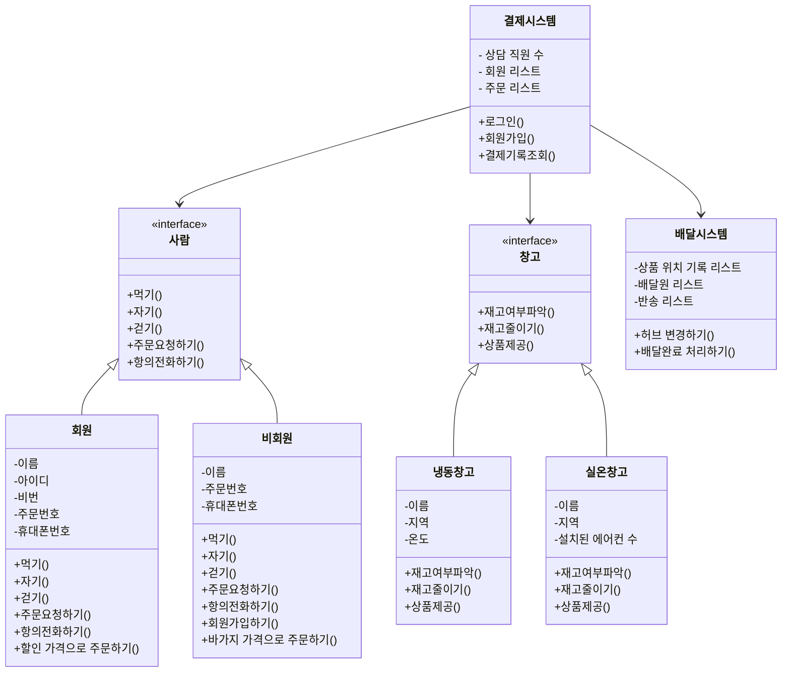

# 인터페이스(`interface`)
앞서 저희는 객체의 메세지, 책임, 역할에 대해 알아보았어요.  
객체는 책임에 따라 결과물을 낼 의무가 있을 뿐, 그 구현에는 신경쓰지 않아요.  
하지만, 일반적인 class 에서는 구현을 제외할 수 없어요.  
그렇다면, 코드 없이 의사코드로만 객체를 표현할 수 있을까요? 
  
이 때 자바의 인터페이스 문법이 등장합니다.  
인터페이스는 메소드의 정의부로만 이루어진 클래스 정의로,  
여러분이 구현없이 객체간의 협력관계를 코드로 표현할 때 유용합니다.

이에 대해 다음의 자료를 통해 공부하고 정리해봅시다.

### [인터페이스의 개념과 문법](https://inpa.tistory.com/entry/JAVA-%E2%98%95-%EC%9D%B8%ED%84%B0%ED%8E%98%EC%9D%B4%EC%8A%A4Interface%EC%9D%98-%EC%A0%95%EC%84%9D-%ED%83%84%ED%83%84%ED%95%98%EA%B2%8C-%EA%B0%9C%EB%85%90-%EC%A0%95%EB%A6%AC#%EC%9D%B8%ED%84%B0%ED%8E%98%EC%9D%B4%EC%8A%A4_%EB%8F%85%EB%A6%BD_%ED%8C%8C%EC%9D%BC)

공부한 내용을 바탕으로,  
아래의 기능을 간단하게 `interface` 로 정의해봅시다.

> 결제 및 배달 시스템  
> 유저가 결제 시스템을 통해 결제하면, 창고의 재고가 감소하고, 배달 시스템으로 전달됩니다.   

### 여러분의 답변을 적어주세요!
